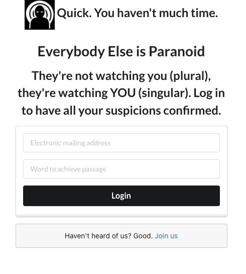

# Everybody Else Is Paranoid

## They're not watching you (plural), they're watching YOU (singular).
## Log in to have all your suspicions confirmed.

Everybody Else Is Paranoid (EEIP) is a tongue-in-cheek, governmental dystopian
MERN app, designed to play on user expectations. Upload a profile picture?
Why? Just because they told you to? Tell them your email? Just because they asked?

Continued development will add to, and gamify, more aspects of .gov banality.

### Technologies

* HTML.
* CSS.
* JSX.
* React.
* Express.
* Node.js.
* Nodemon.
* Mongoose.
* MongoDB.
* Amazon AWS.

## Getting Started:

**link to deployed app:** *Coming soon, due to Heroku terms of service changes*
**link to Trello board:** https://trello.com/b/XJ7fDce8/everyone-else-is-paranoid

## Next Steps:

* The CSS is purposefully cheap-looking, to mimic a poor-grade government portal. Further CSS will strike a better balance between cheap-looking and enjoyable.
* Add more Math.random capabilities.
* Continue to work on CSS.
* Gamify log in and info process.
* Allow snoops to influence how often a suspect appears.
